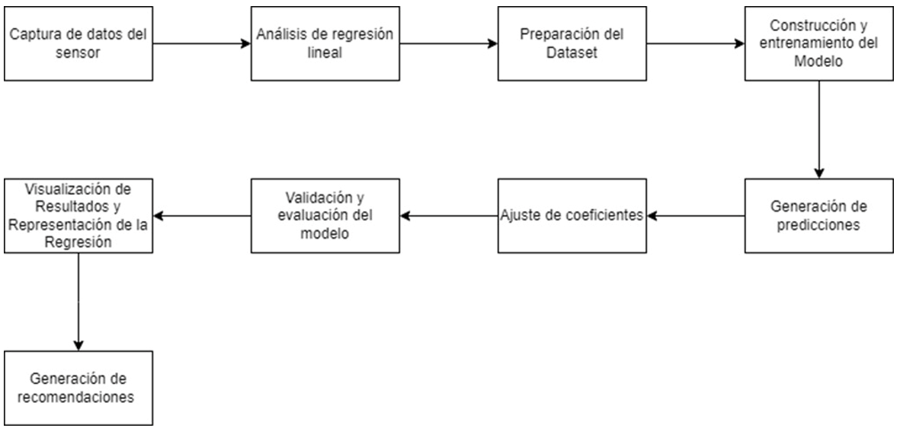

# 🌱 Sistema Experto de Recomendación para Cultivo de Papa

Este proyecto implementa un sistema experto que recomienda prácticas de fertilización para el cultivo de papa. Basado en parámetros como pH, humedad del suelo y niveles de nitrógeno (N), fósforo (P) y potasio (K), el sistema sugiere la mejor forma y momento para aplicar fertilizantes.

---

## 🧠 Objetivo

Brindar recomendaciones precisas para mejorar la eficiencia en la aplicación de fertilizantes, evitar lixiviación y maximizar la calidad y el rendimiento del cultivo de papa.

---

## 📁 Estructura del Proyecto

```plaintext
SE/
├── SE.py                # Script principal: lógica del sistema experto
├── regresionLineal.py   # Módulo de regresión lineal para predicción de absorción
├── Diagrama.png         # Diagrama funcional del sistema
├── README.md            # Documentación
└── requirements.txt     # Dependencias necesarias



## 🛠️ Instalación

1. Clona el repositorio:
    git clone https://github.com/criseen7/SE.git
    cd SE

## 👥 Créditos

Desarrollado por Cristofer Raziel HB (https://github.com/criseen7).
